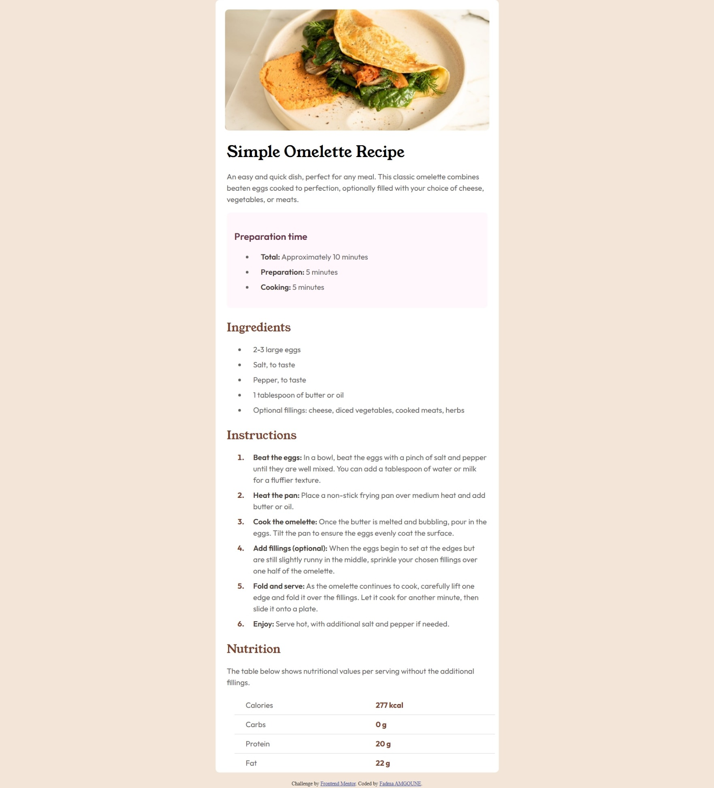
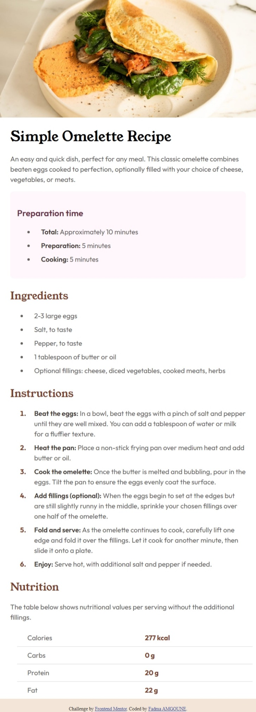

# Frontend Mentor - Recipe page solution

This is a solution to the [Recipe page challenge on Frontend Mentor](https://www.frontendmentor.io/challenges/recipe-page-KiTsR8QQKm). Frontend Mentor challenges help you improve your coding skills by building realistic projects. 

## Table of contents

- [Overview](#overview)
  - [Screenshot](#screenshot)
  - [Links](#links)
- [My process](#my-process)
  - [Built with](#built-with)
  - [What I learned](#what-i-learned)
  - [Continued development](#continued-development)
- [Author](#author)

## Overview

This project is a simple recipe page built using HTML and CSS. It is responsive and works well on both mobile and desktop devices.

### Screenshot

### Links

- Solution URL: 
- Live Site URL: 

## My process

I started by building the HTML structure using semantic elements.

Then I styled the page using CSS, focusing on layout and typography.

Finally, I added responsive design using media queries to make it work on mobile and desktop.

### Built with
- Semantic HTML5
- CSS custom properties
- Flexbox
- Mobile-first workflow

### What I learned

I learned how to use media queries correctly and how CSS specificity affects styling order.

### Continued development

I want to improve my Flexbox skills and learn Grid next.

## Author

- Frontend Mentor - [@fadmaamgoune](https://www.frontendmentor.io/profile/fadmaamgoune)
